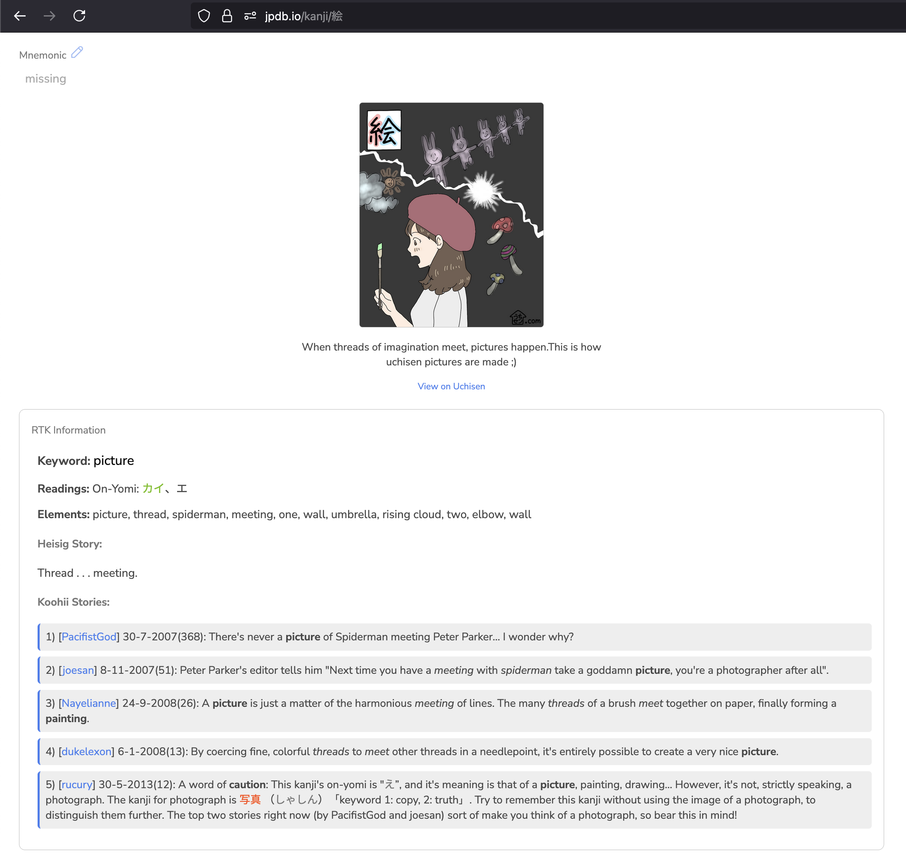

# JPDB Enhancement Scripts

Enhance your JPDB experience with visual mnemonics and RTK information.

## Scripts

### 1. Uchisen Image Inserter
Displays Uchisen visual mnemonics on JPDB kanji pages and reviews.

[📥 **Install Uchisen Script**](https://raw.githubusercontent.com/HRussellZFAC023/UchiDb/refs/heads/main/jpdb-uchisen-userscript.js)

### 2. RTK Information Inserter
Adds RTK (Remembering the Kanji) information including Heisig stories, elements, and Koohii community stories.

[📥 **Install RTK Script**](https://raw.githubusercontent.com/HRussellZFAC023/UchiDb/refs/heads/main/jpdb-rtk-userscript.js)

If scripts aren't auto-detected, open Tampermonkey → Utilities → Import from URL

*Requires [Tampermonkey](https://www.tampermonkey.net/)*

---

**Features:**
- 🎨 **Uchisen**: Visual mnemonic images with story text
- � **RTK**: Heisig stories, elements, readings, and Koohii stories
- 🌙 Light/dark theme support
- 🔄 Works in reviews and kanji pages
- ✅ Compatible with JPDB Pro
- 🤝 Scripts work together seamlessly

